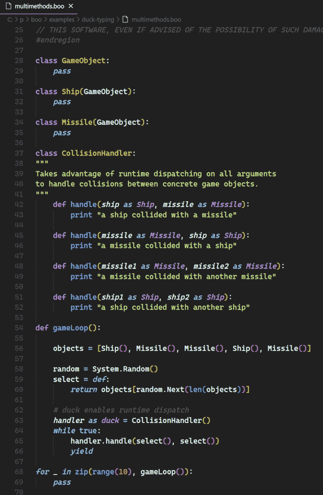

# Boo extension for VS Code

This is the syntax hightlighting extension for the
[Boo](https://boo-language.github.io/) language.

## Features

This is only offering Syntax hightlighting.

## Installing

Go to the [VS Code Marketplace](https://marketplace.visualstudio.com/items?itemName=GiovanniBassi-MVP.codeboo)
or search for `Boo` language on Visual Studio Code extensions pane.

## Screenshots

## Contributing

Questions, comments, bug reports, and pull requests are all welcome.  Submit them at
[the project on GitHub](https://github.com/giggio/codeboo).

Bug reports that include steps-to-reproduce (including code) are the
best. Even better, make them in the form of pull requests.

## Author

[Giovanni Bassi](https://github.com/giggio).

Based on the work of [@drslump](https://github.com/drslump/sublime-boo), who based
[their work](https://github.com/drslump/sublime-boo)
on [@Shammah](https://github.com/Shammah)'s, making syntax hightlighting for Boo on Sublime Text.

## License

Licensed under the MIT License.
